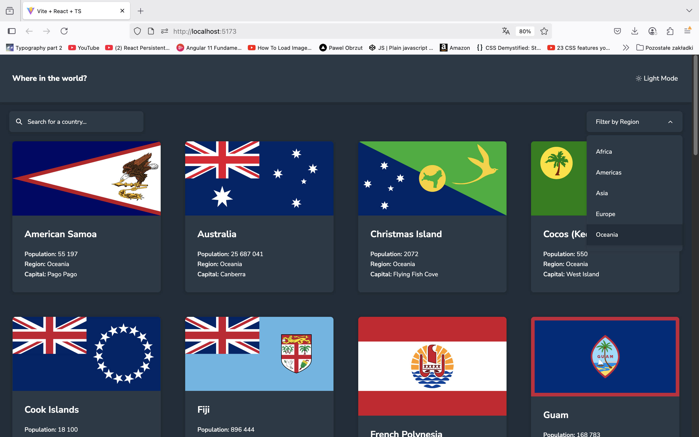
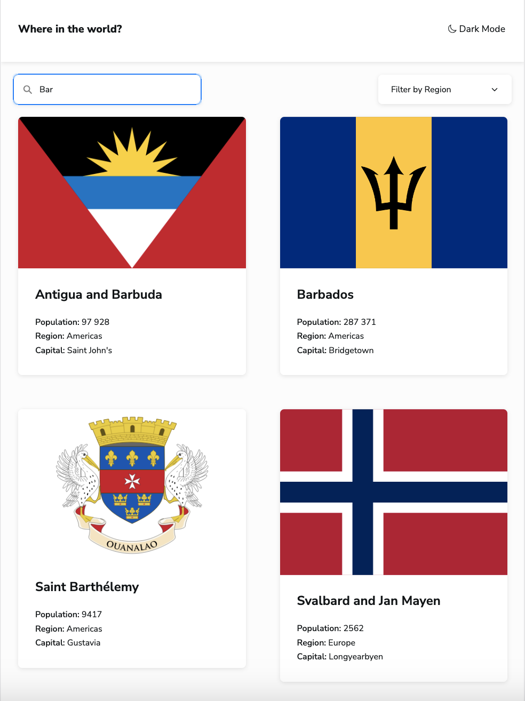

# REST Countries API 
This is a Frontend Mentor challenge that involves building a React app and integrating it with a RESTful API. To take it a step further, I replaced the external API with a custom-built Express server that exposes similar endpoints.

```
Objectives:

- See all countries from the API on the homepage
- Search for a country using an `input` field
- Filter countries by region
- Click on a country to see more detailed information on a separate page
- Click through to the border countries on the detail page
- Toggle the color scheme between light and dark mode
```

## 🛠️ Built with
- Typescript
- Styled react components
- CSS Grid
- Semantic HTML5 markup
- Mobile-first approach
- Node /express/
- Testing with Jest

## 📸 Screenshots




## 🚀 Getting Started

To run the project locally clone the repository. You shall have client and sever and both need to have node modules installed. In development mode the backend runs on port 3000 and the client on 5173.
